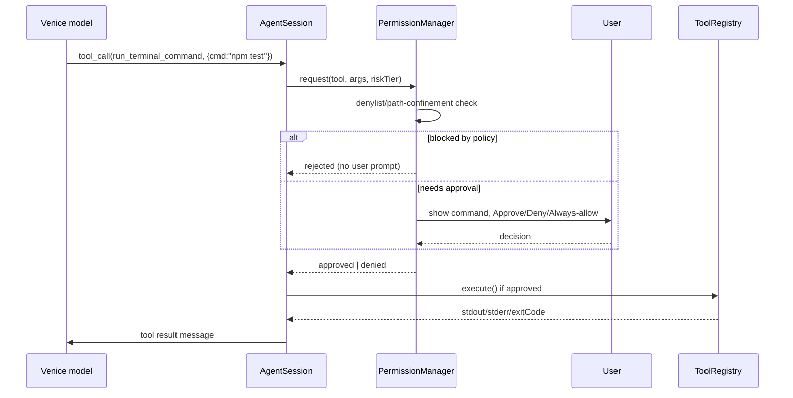

# Venice AI for VS Code — Architecture Plan for Copilot/Claude-Code Parity

Status: proposal. Target: bring `venice-ai-vscode` from a chat + inline-completion extension to a
context-aware, tool-using coding agent comparable to GitHub Copilot Chat / Copilot Workspace and
Claude Code.

## 0. Current state (baseline)

The repo today (`src/`) is four files:

| File | Role | Limitation |
|---|---|---|
| `api/venice.ts` | `VeniceClient` — thin wrapper over `POST /chat/completions` (OpenAI-compatible), streaming + non-streaming, API key in `context.secrets` | No tool/function-calling, no embeddings call, no retry/backoff |
| `chat/chatProvider.ts` | `ChatViewProvider` — single webview, one linear `ChatMessage[]` history, no persistence across reloads | No workspace context, no file references, no multi-turn tool use |
| `completion/inlineProvider.ts` | `InlineCompletionProvider` — debounced prefix/suffix completion | Fixed ±50 line window, no symbol/import awareness, no multi-file context |
| `utils/context.ts` | `getCodeContext` / `getFullFileContext` | Pure text-window slicing, no AST/semantic understanding |

There is no workspace indexing, no tool execution, no git/terminal/debugger integration, and no
permission model beyond "is an API key set." Everything below is additive: new modules layered
on top of the existing `VeniceClient`, not a rewrite of it.

## 1. Core architectural pillars

1. **Context Engine** — repository-wide semantic understanding, cheaply kept up to date.
2. **Generative Core** — an agent loop (plan → tool calls → apply → verify) replacing the current
   single-shot `chat()`/`complete()` calls, capable of proposing coordinated multi-file edits.
3. **Tooling Integration Layer** — typed tools over VS Code's Terminal, Git, Debugger, and
   Filesystem APIs, invoked by the model through structured calls, never free-text shell strings.
4. **Security & Permissions Model** — an approval gate between "model wants to do X" and "X
   happens," plus content controls over what ever leaves the machine.

## 2. High-level system diagram

```mermaid
flowchart LR
    subgraph VSCode["VS Code Host"]
        Editor[Editor / Workspace]
        Term[Integrated Terminal]
        GitExt[Built-in Git Extension]
        Debug[Debug Adapter]
    end

    subgraph Ext["Venice Extension (Extension Host)"]
        CE[Context Engine\nIndexer + Retriever]
        AC[Agent Core\nPlan/Act/Observe loop]
        TL[Tool Layer\nfs, terminal, git, debug]
        PM[Permission Manager]
        VC[VeniceClient]
        Cache[(Local index +\nembedding cache\nglobalStorageUri)]
    end

    subgraph Backend["Venice AI Backend"]
        Chat[chat/completions\n+ tool calling]
        Embed[embeddings endpoint\n(or local fallback)]
    end

    Editor <-->|documents, selections, diagnostics| CE
    CE <--> Cache
    CE -->|ranked context| AC
    AC -->|tool_calls| PM
    PM -->|approved| TL
    TL --> Term
    TL --> GitExt
    TL --> Debug
    TL -->|fs read/write via WorkspaceEdit| Editor
    AC <--> VC
    VC <--> Chat
    CE <--> VC
    VC <--> Embed
```

## 3. Phase plan

### Phase 1 — Foundational Context Indexing

**Goal:** answer "what in this repo is relevant to what the user is doing right now" without
re-reading the whole tree on every keystroke.

**Analysis — LSP vs. custom parsing:**

| | LSP (`vscode.executeDefinitionProvider`, `executeWorkspaceSymbolProvider`, `executeReferenceProvider`, `executeDocumentSymbolProvider`) | Custom parser/index (tree-sitter, regex chunking) |
|---|---|---|
| Pros | Zero maintenance, exact per-language semantics, already running for the user, free cross-file "go to definition"/"find references" graph | Works for every file type uniformly, produces embeddable chunks, gives us a similarity/relevance signal LSP doesn't have |
| Cons | Only available if a language server is installed; no notion of "semantic similarity," can't rank by relevance, some languages have weak/no LSP | Have to build and maintain it; duplicates work the LSP already does for symbol accuracy |

**Recommendation: hybrid, not either/or.** Use the LSP via `vscode.executeXxxProvider` commands
for anything precise and structural (definitions, references, call hierarchy, diagnostics) —
this is free, accurate, and already there. Layer a lightweight custom index *only* for what LSP
cannot give us: fuzzy semantic retrieval across files ("find code related to this natural-language
request"). Building a second symbol resolver would be wasted effort competing with a system
already installed in the user's editor.

**Components:**

```ts
// src/context/workspaceIndexer.ts
class WorkspaceIndexer {
  async buildInitialIndex(): Promise<void>            // vscode.workspace.findFiles + .gitignore/.veniceignore filter
  async reindexFile(uri: vscode.Uri): Promise<void>    // on save/change, debounced
  async removeFile(uri: vscode.Uri): Promise<void>
  getStatus(): IndexStatus                             // for status bar item
}

// src/context/chunker.ts
function chunkDocument(doc: vscode.TextDocument): CodeChunk[]
// Prefer boundaries from vscode.executeDocumentSymbolProvider (function/class/method ranges);
// fall back to tree-sitter WASM grammars for languages without symbol providers;
// fall back further to fixed-size sliding window for plain text/config files.

// src/context/embeddingStore.ts
class EmbeddingStore {
  async upsert(chunk: CodeChunk, vector: Float32Array): Promise<void>
  async query(vector: Float32Array, k: number): Promise<ScoredChunk[]>  // cosine similarity
}
// Backed by SQLite (better-sqlite3, bundled as a prebuilt binary per platform) in
// context.globalStorageUri. Store content-hash per chunk so unchanged chunks are never
// re-embedded after an edit that doesn't touch them.

// src/context/relevanceRanker.ts
function rank(chunks: ScoredChunk[], signals: RankingSignals): ScoredChunk[]
// signals: embedding similarity, import-graph distance from current file (via LSP references),
// path proximity, recency of edit (vscode.workspace.onDidSaveTextDocument history).
```

**File watching / incrementality:** `vscode.workspace.createFileSystemWatcher('**/*')`, debounced
per-file (300–500ms), gated by a `.gitignore`-derived exclude set (use the `ignore` npm package
against the repo's `.gitignore` plus a new `.veniceignore`). Index writes happen off the extension
host's hot path — see Phase 4 for scheduling.

### Phase 2 — Advanced Generative Capabilities

**Goal:** move from "one prompt → one text blob" to a loop that can read files, decide it needs
more context, and emit coordinated edits across multiple files.

**Analysis — prompt structure & token budget:** treat context assembly as a priority-ordered fill,
cheapest/most-certain-to-help first, dropping the tail when the budget (derived from the model's
context window minus a reserved output allowance) is exceeded:

1. Current file, cursor-centered window (already have this — `getCodeContext`).
2. Open diagnostics on the active file (`vscode.languages.getDiagnostics`) — near-zero cost, high value.
3. Symbols referenced from the cursor's scope, resolved via LSP (`executeDefinitionProvider` on each identifier in scope).
4. Top-K semantically similar chunks from `EmbeddingStore.query()`, re-ranked by `relevanceRanker`.
5. Recent chat history (sliding window, older turns summarized rather than dropped verbatim).

Each candidate has an estimated token cost (approximate via `text.length / 4` unless Venice
exposes a tokenizer); fill the budget top-down and stop.

**Agent loop:**

```ts
// src/agent/agentSession.ts
class AgentSession {
  async run(userRequest: string): Promise<void> {
    // 1. assembleContext() using ContextEngine
    // 2. call VeniceClient.chat(messages, { tools: ToolRegistry.schemas() })
    // 3. if response has tool_calls -> PermissionManager.request() -> ToolRegistry.execute()
    //    append tool result as a 'tool' role message, loop back to 2
    // 4. if response is a final message with proposed edits -> present as a diff for
    //    review (vscode.diff / WorkspaceEdit preview) before applying
    // 5. cap iterations (e.g. 25) and wall-clock time; surface a "stop" affordance to the user
  }
}
```

**Multi-file edits as data, not prose:** the model should emit structured edit operations
(`{tool: "apply_patch", path, diff}` or `{tool: "write_file", path, content}`), never "here's what
you should paste." The extension applies them via `vscode.workspace.applyEdit(WorkspaceEdit)`
after the user approves a shown diff — this is what makes edits reviewable and undoable via VS
Code's own undo stack, and it's the main UX gap vs. Copilot Workspace today.

**Backend dependency to confirm:** the above assumes Venice's `/chat/completions` accepts an
OpenAI-style `tools` array and returns `tool_calls`. If Venice's API doesn't support native
function-calling yet, the fallback is constrained JSON-mode prompting (system prompt demands a
strict `{tool, args}` JSON envelope, parsed with a schema validator, one retry on parse failure
before surfacing an error) — same `AgentSession` interface, different `VeniceClient` internals, so
nothing downstream needs to change if/when native tool-calling ships.

### Phase 3 — Tooling & Workflow Automation

```ts
// src/tools/toolRegistry.ts
interface Tool {
  name: string;
  schema: JSONSchema;               // sent to the model as the tool definition
  riskTier: 'readOnly' | 'workspaceWrite' | 'exec' | 'destructive';
  execute(args: unknown): Promise<ToolResult>;
}
```

| Tool | VS Code API | Risk tier |
|---|---|---|
| `read_file`, `list_directory`, `search_workspace` | `vscode.workspace.fs`, `vscode.workspace.findFiles`, ripgrep via `child_process.execFile('rg', [...argv])` | readOnly |
| `apply_patch`, `write_file` | `vscode.workspace.applyEdit(WorkspaceEdit)` | workspaceWrite |
| `run_terminal_command` | VS Code Terminal Shell Integration API: `vscode.window.createTerminal`, `terminal.shellIntegration.executeCommand`, `onDidStartTerminalShellExecution` / `onDidEndTerminalShellExecution` for exit-code capture | exec |
| `git_status`, `git_diff`, `git_commit`, `git_branch` | `vscode.extensions.getExtension('vscode.git')!.exports.getAPI(1)` (the built-in Git extension's public API — avoid shelling out to `git` directly where this API covers it) | workspaceWrite (commit) / readOnly (status, diff) |
| `debug_start`, `set_breakpoint` | `vscode.debug.startDebugging`, `vscode.debug.addBreakpoints` | exec |

**Analysis — terminal security:** the dangerous path is an LLM emitting a shell string that gets
handed to `child_process.exec` and interpolated with untrusted content. Design:

- The model never gets to construct an actual shell string that's `exec`'d blind. It emits
  `{command: string, cwd: string}`; the extension parses `command` with `shell-quote` into an
  argv array purely to *inspect* it (never to re-serialize and pass to a shell).
- **Denylist gate** on `argv[0]` and on any `;`, `&&`, `|`, backtick, or `$(...)` composition that
  would chain a disallowed command after an allowed one: `rm`, `dd`, `mkfs*`, `shutdown`,
  `reboot`, `sudo`, `chmod -R 777`, curl/wget piped into a shell, fork bombs. This is a safety
  net, not the primary control — see next point.
- **Primary control is human approval, not the denylist.** Every `run_terminal_command` call
  surfaces the literal command text via VS Code's real Terminal Shell Integration (the user sees
  it about to run in an actual terminal pane, exactly as typed) with Approve/Deny before
  execution. No silent auto-run by default.
- **Path confinement:** any file-path argument is resolved with `path.resolve(cwd, arg)` and
  rejected if it does not start with the workspace root (blocks `../../etc/passwd`-style escapes
  or writes outside the project).
- **Scoped "always allow"**: a user can pin an exact command string (not a pattern) to
  auto-approve for the rest of the session, stored per-workspace, never persisted globally, never
  covering `exec`/`destructive` tiers by default.

Sequence for any tool call:



### Phase 4 — Security, Performance, and Polish

- **Secrets:** keep the existing `context.secrets` pattern for the API key; extend it to any
  future OAuth tokens. Don't introduce a second storage mechanism.
- **Sensitive-code exclusion:** a `.veniceignore` (gitignore syntax) respected by both the indexer
  *and* the context-assembly step, so an excluded file is never sent even if the user manually has
  it open. Add a lightweight secret-pattern scan (AWS key patterns, PEM private-key headers,
  generic high-entropy strings near words like `key`/`token`/`secret`) that redacts matches from
  any chunk before it leaves the machine, plus a per-workspace "Venice: disable for this
  workspace" setting.
- **Network failures:** wrap `VeniceClient` calls with exponential backoff + a circuit breaker
  (open after N consecutive failures, half-open retry after a cooldown). On open-circuit, inline
  completions silently return `[]` (already the pattern for missing API key) and chat surfaces a
  status-bar/webview banner rather than throwing per-message errors.
- **Large monorepos:** index incrementally (mtime + content hash, never full re-scan after the
  first run), scope indexing to open workspace folders, prioritize a "hot set" (files touched in
  the last N days via git log / recently opened) before a slow background sweep of the rest, cap
  total on-disk index size, and always yield to the extension host event loop — indexing must
  never block typing. Surface a `Venice: Show Index Status` command instead of silent background
  work the user can't see or pause.

## 4. VS Code API integration checklist

`vscode.workspace.{findFiles, fs, applyEdit, onDidSaveTextDocument, createFileSystemWatcher, getConfiguration}`,
`vscode.languages.{registerInlineCompletionItemProvider, getDiagnostics, executeDefinitionProvider, executeReferenceProvider, executeDocumentSymbolProvider, executeWorkspaceSymbolProvider}`,
`vscode.window.{createTerminal, showInformationMessage (approval prompts), withProgress, createStatusBarItem, registerWebviewViewProvider}`,
`vscode.debug.{startDebugging, addBreakpoints, onDidTerminateDebugSession}`,
`vscode.extensions.getExtension('vscode.git')` for the Git API,
`context.{secrets, globalStorageUri, workspaceState}`.

## 5. Backend requirements (Venice AI side)

1. Confirm/add OpenAI-style `tools` + `tool_calls` support on `/chat/completions` — this is the
   load-bearing dependency for Phase 2/3; without it, fall back to the constrained-JSON prompting
   scheme noted above.
2. An embeddings endpoint (`/embeddings`, OpenAI-shaped) for `EmbeddingStore`. If unavailable,
   run a small local model (e.g. `@xenova/transformers` in-process, ONNX, CPU-only) so semantic
   retrieval doesn't hard-depend on a backend feature that may not exist yet.
3. No backend changes are required for the tool *execution* itself — that always happens locally
   in the extension host. The backend only ever sees tool call requests/results as chat messages.

## 6. Edge cases

| Case | Handling |
|---|---|
| Tens-of-thousands-of-files monorepo | Incremental + scoped indexing (Phase 4); never a blocking full-repo pass |
| Proprietary/sensitive code | `.veniceignore`, secret-pattern redaction, per-workspace opt-out (Phase 4) |
| Backend unreachable | Circuit breaker + graceful degrade, no thrown errors into completion UI (Phase 4) |
| Malicious/destructive command | Denylist + path confinement + mandatory human approval via real terminal shell integration, argv-based execution instead of shell string interpolation (Phase 3) |
| Model hallucinates a tool call to a nonexistent tool/path | `ToolRegistry` validates against the JSON schema before execution; unknown tool name or schema-invalid args are rejected and fed back to the model as an error, never silently executed |
| Runaway agent loop | Hard iteration cap + wall-clock timeout + visible "Stop" action in the chat UI |

## 7. Sequencing

Phase 1 and the Permission Manager (part of Phase 3) should land before Phase 2's agent loop ships
to any user — an agent loop with tool-calling and no approval gate is the one ordering that's
actually unsafe. Phase 4's exclusion/redaction controls should also predate turning on any
repo-wide indexing by default, not follow it.
